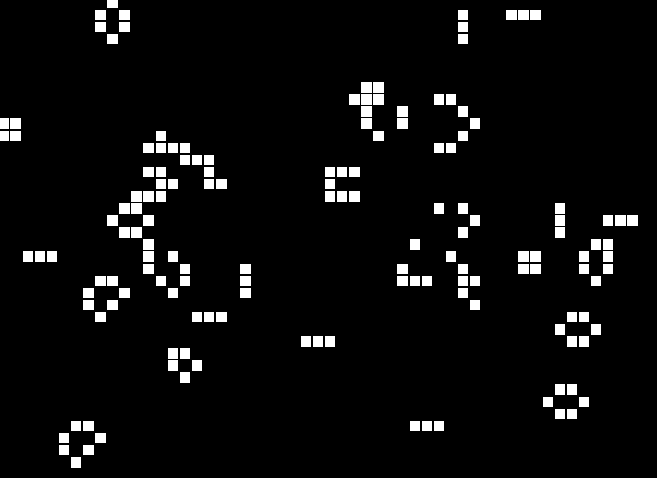

# gameOfLife edited by Ahmed

<h2>Concept: </h2>
The universe of the Game of Life is an infinite, two-dimensional orthogonal grid of square cells, each of which is in one of two possible states, alive or dead, (or populated and unpopulated, respectively). Every cell interacts with its eight neighbours, which are the cells that are horizontally, vertically, or diagonally adjacent. At each step in time, the following transitions occur:

1. Any live cell with fewer than two live neighbours dies, as if by underpopulation.
2. Any live cell with two or three live neighbours lives on to the next generation.
3. Any live cell with more than three live neighbours dies, as if by overpopulation.
4. Any dead cell with exactly three live neighbours becomes a live cell, as if by reproduction.

<h2>How to run: </h2>
1. Clone or download the project files.
2. cd into the project folder using your terminal
3. run a server (explained further)
4. go to localhost url where the server is running 

Running the server:
1. Using VSCODE: 
  Open project folder in VSCODE editor.
  Right-click on the index.html file and click on Open with Live Server
  
  OR
  
2. Python SimpleHTTPServer:
  cd to project folder via terminal.
  run the command : python -m SimpleHTTPServer 8080(or any port of your choice)
  type localhost:8080(or your port number) in the browser

